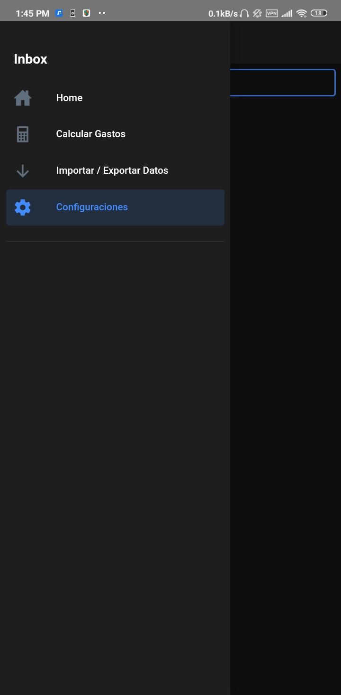
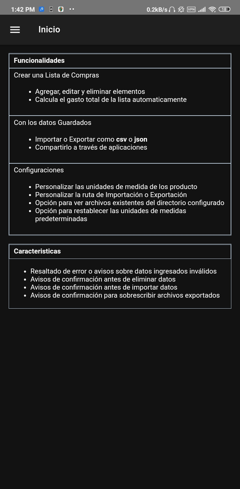
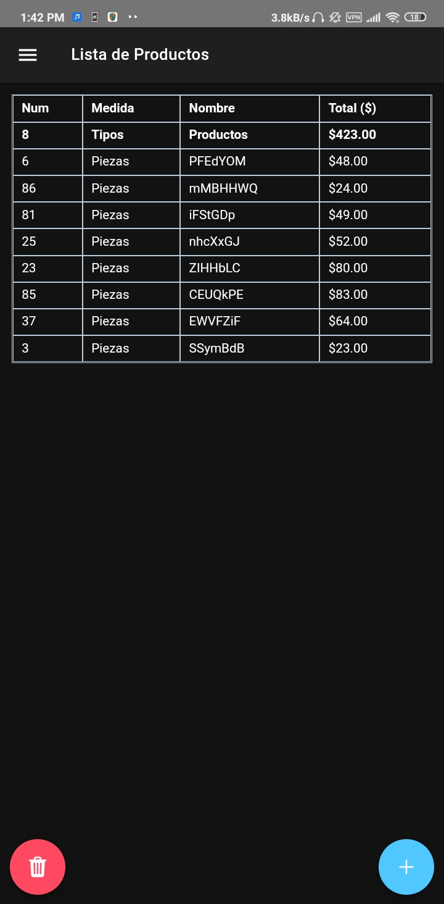
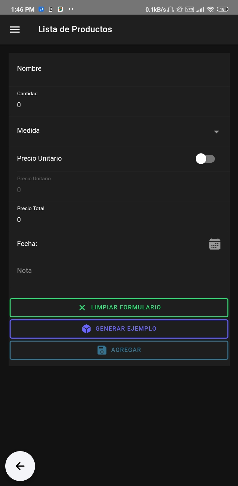
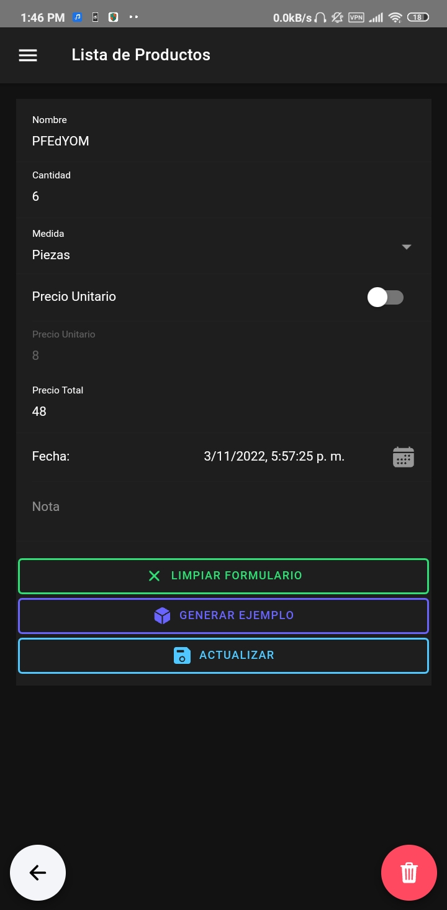
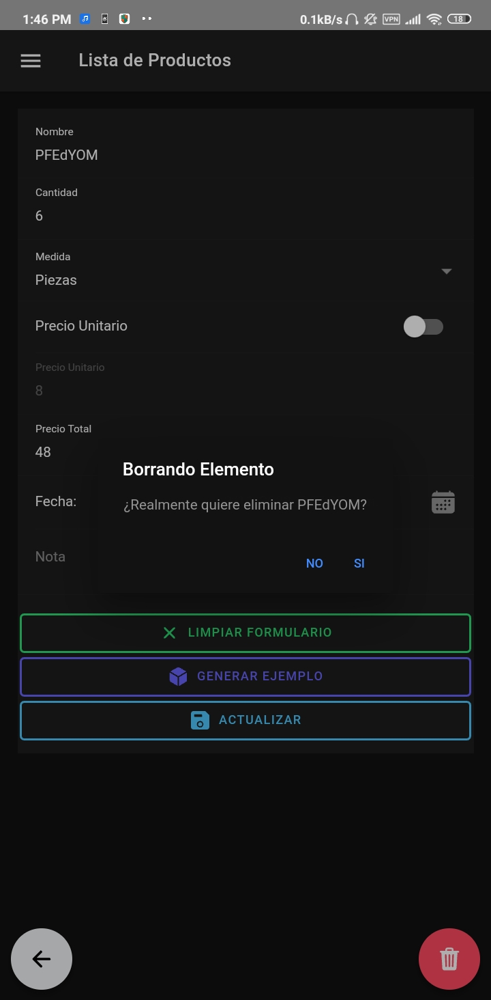
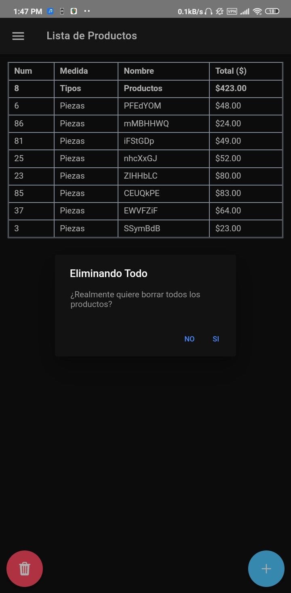
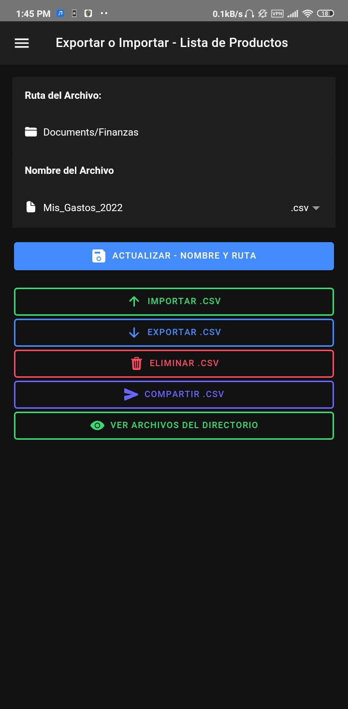
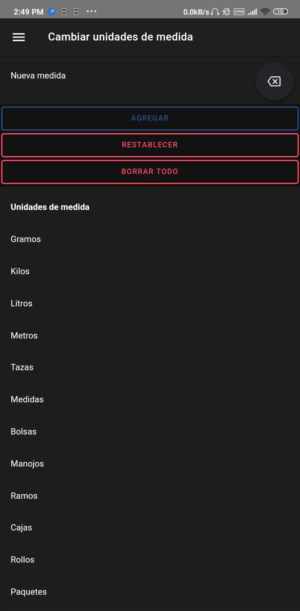

## App - Lista_Productos
---
#### Funcionalidades

* Crear una lista de compras
	+ Agregar, editar y eliminar elementos
    + Calcular el gasto total automáticamente
* Con los datos guardados
    + Importar o Exportar como **csv** o **json**
    + Compartir a través de aplicaciones
* Configuraciones
    + Personalizar las unidades de medida de los productos
    + Personalizar la ruta de Importación o Exportación
    + Opción para ver archivos existentes del directorio configurado
    + Opción para restablecer las unidades de medida predeterminadas

#### Características

* Resaltado de error o avisos sobre datos ingresados inválidos
* Avisos de confirmación antes de eliminar datos
* Avisos de confirmación antes de importar datos
* Avisos de confirmación para sobrescribir archivos exportados

---
| # | Screenshot |
| --- | --- |
| Menu |   |
| Inicio |   |
| Calculadora |   |
| Agregar |   |
| Actualizar |   |
| Eliminar |   |
| Borrar Lista |   |
| Importar / Exportar |   |
| Configuraciones |   |
| Medidas |   |
